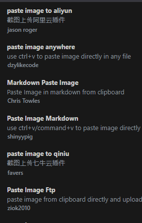

## The problem

I ran into this on a recent web app engagement for a social media platform. Cloudflare sat in front of the target, and it kept dropping anything that came out of Burp Suite. Browsing the site normally was fine, but as soon as routed requests through the Burp proxy they came back blocked. Since the whole team was working through Burp, this was clearly unacceptable.

## Previous attempts

The first thing I tried was [burp-awesome-tls](https://github.com/sleeyax/burp-awesome-tls), a Burp extension that rewrites the TLS/JA3 fingerprint so the handshake looks like a real browser. That made sense to me at the time, since a good chunk of Cloudflare's detection probably happens on the TLS level.

Setup was very minimal. I installed the extension, and I pretty much left it on the default fingerprint and didn't touch anything else.

...And it looked like it worked for the most part. The first few requests went through, which is exactly the kind of thing that makes you think you're done. Then the blocks came back after a handful of requests. It was clear that changing the TLS connection on its own wasn't enough, so I went looking for something else.

## Why Cloudflare flags Burp

There are (at least probably) two things that give Burp away before you even get to the request body.

The first is HTTP/2. Browsers negotiate HTTP/2 with Cloudflare, and because HTTP/2 is a protocol that relies on sending/receiving frames, it can still leak information within the messages that are exchanged, forming a sort of fingerprint. Burp's HTTP/2 implementation most likely doesn't match what Chrome or Firefox actually send, and Cloudflare notices the difference.

The second is headers. Headers like `X-Forwarded-For`, `Via`, `X-Forwarded-Host`, or `X-Forwarded-Proto` can very easily indicate that a proxy is in place, which could be flagged as suspicious by Cloudflare.

Between the protocol fingerprinting and the extra headers, the traffic doesn't look like a browser anymore, and we get blocked as a result.

## The fix

What ended up working was chaining a small [mitmproxy](https://mitmproxy.org/) script in front of Burp and letting it clean up the traffic on the way out. The chain looks like this: browser > Burp > mitmproxy > Cloudflare. mitmproxy handles two things here: it forces everything down to HTTP/1.1 so there's no HTTP/2 fingerprint to fail, and it fabricates headers and removes extraneous ones so the request looks like it came from a normal browser like Chrome.

> You probably need to disable awesome-tls when using this. I ran into issues when using both simultaneously.
{: .prompt-warning }

```python
from mitmproxy import http
from mitmproxy.net.http import http1

class CloudflareBypass:
    def request(self, flow: http.HTTPFlow):
        # Force HTTP/1.1 requests
        flow.request.http_version = "HTTP/1.1"

        headers_to_remove = [
            "x-forwarded-for",
            "via",
            "x-forwarded-host",
            "x-forwarded-proto",
        ]
        for h in headers_to_remove:
            if h in flow.request.headers:
                del flow.request.headers[h]

        flow.request.headers["User-Agent"] = (
            "Mozilla/5.0 (Windows NT 10.0; Win64; x64) "
            "AppleWebKit/537.36 (KHTML, like Gecko) "
            "Chrome/132.0.0.0 Safari/537.36"
        )
        flow.request.headers["Accept"] = (
            "text/html,application/xhtml+xml,application/xml;"
            "q=0.9,image/avif,image/webp,*/*;q=0.8"
        )
        flow.request.headers["Accept-Language"] = "en-US,en;q=0.9"
        flow.request.headers["Accept-Encoding"] = "gzip, deflate, br"
        flow.request.headers["Connection"] = "keep-alive"

    def response(self, flow: http.HTTPFlow):
        # Downgrade response to HTTP/1.1
        flow.response.http_version = "HTTP/1.1"

addons = [CloudflareBypass()]
```

## Running it

Run `mitmproxy` with the script as an upstream proxy, then have Burp send its traffic through it:

```bash
mitmdump -s cloudflare_bypass.py --listen-port 8082 --ssl-insecure --no-http2
```

In Burp, set the upstream proxy (User options, Upstream Proxy Servers) to point at mitmproxy's listen port.



After this simple setup, the blocks stopped and the whole team was back to testing normally!

## Notes

- Play around with the headers and the browser fingerprint. A different set of headers may work better in your case.
- This only deals with fingerprint and header based blocking. It won't help with rate limiting or behavioral bot scoring.
- Obvious, but worth saying: only run this against something you're authorized to test. Happy hacking!

## References

- [How to Get Burp Suite Through Cloudflare WAF: What Actually Works (2026)](https://medium.com/@sameerimr384/how-to-get-burp-suite-through-cloudflare-waf-what-actually-works-2026-9fc1c6cd6a92)
